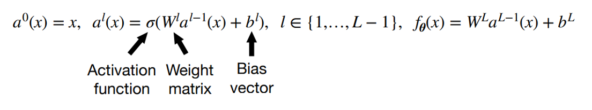
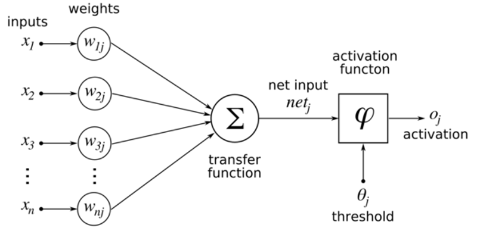

# FNN

FNN은 가장 기본적인 형태의 신경망 중 하나이다. 본 글에서는 FNN을 다음과 같이 구성한다.

1. FNN을 [$P^0, P^1, \ldots, P^k, P^{k+1}$]로 초기화한다. 이때 $P^0$가 Input Data의 크기가 되며, $P^{k+1}$가 Output Data의 크기가 된다. $P^1$부터 $P^k$는 각 Layer들의 퍼셉트론 갯수가 된다. 즉 $Layer^n$은 $P^n$개의 퍼셉트론을 가지며, (1, $P^n$) 행렬이 된다.\\

2. Layer들의 크기가 정해지면 이에 따라 Weight와 Bias의 크기와 초깃값을 결정한다. Weight는 $Weight^0$부터 $Weight^k$ 까지 있으며, $Weight^n$은 ($P^n$, $P^{n+1}$) 크기를 갖는 행렬로써 $Layer^n$에서 $Layer^{n+1}$로 값을 곱하여 전달한다. 식은 다음과 같다.

$$Layer^{n+1}_b=$$

$$\sum_{a=1}^{P^{n}}ActiveFunction(Layer^n_a) \cdot Weight^n_{ab} + Bias^n_b$$

$$Total Loss = \sum_{b=1}^{P^{k+1}}Loss function(output function(L^{k+1}_b), Target value)$$

# Learning by gradient descent
다층 레이어로 이뤄진 신경망, DNN이 임의로 주어진 DataSet에 대해 각 DataSet을 원하는 정답에 mapping 할 수 있을 만큼의 height와 depth를 갖는다 가정하자. 이때 경사하강법을 사용하여 Loss에 대한 식이 convex하다 가정할 때 임의로 주어진 초기 weight와 bias를 갱신하여 input에 대해 원하는 output을 mapping하는 최적의 weight와 bias를 찾을 수 있다.

위의 식처럼 FNN을 구성하였을 때, 우리에게 주어진 목적은 Output과 정답 사이의 차이, Loss를 최소화하는 것이다. 그런데 주어진 Input에 대해 Loss는 Weight와 Bias의 곱과 합으로 나타내어지므로, Weight와 Bias를 변화시키면 Loss도 변화한다는 것을 알 수 있다. 따라서

${\displaystyle\frac{\partial Loss}{\partial Weight_{k-i}}}$,  
${\displaystyle\frac{\partial Loss}{\partial Bias_{k-i}}}$

을 구하면, Weight와 Bias를 갱신시켜 input에 대해 우리가 원하는 값으로 output을 mapping하는 비선형 함수에 근사하는 신경망을 만들 수 있다. 공식은 다음과 같다.

$\displaystyle\frac{\partial Loss}{\partial Weight_{k-i}} =
\frac{\partial Loss}{\partial Layer_{k+1}} \cdot (\prod_{t=1}^i \frac{\partial Layer_{k+2-t}}{\partial Layer_{k+1-t}}) \cdot \frac{\partial Layer_{k+1-i}}{\partial Weight_{k-i}}$\\

$\displaystyle\frac{\partial Loss}{\partial Bias_{k-i}} =
\frac{\partial Loss}{\partial Layer_{k+1}} \cdot (\prod_{t=1}^i \frac{\partial Layer_{k+2-t}}{\partial Layer_{k+1-t}}) \cdot \frac{\partial Layer_{k+1-i}}{\partial Bias_{k-i}}$

다른 형태로도 식을 작성할 수 있으나, 코드로 옮기기 용이하게 하기 위해 위처럼 표현하였다.\\
코드로 옮긴 형태는 아래와 같다.

$\displaystyle \frac{\partial Loss}{\partial Weight_{k-i}} = Active(Layer^{k-i}).T \cdot \frac{Loss(Output function(Layer_{k+1}), target)}{\partial Layer^0} \cdot \frac{Output function(Layer_{k+1})} {\partial Layer^0} \cdot \prod_{t=1}^i (Weight^{k-t}.T \times \frac{Active function(Layer_{k-t})} {\partial Layer^0})$

(이때 식에서 전치가 취해진 것은 행렬미분법칙에 다른 야코비안 행렬이 되기 때문이다.)

이제 이 식을 이용해 Learning rate를 설정하여 Loss가 최소가 되는 Weight, Bias를 찾을 수 있다. 방법은 다음과 같다.

초기화시킨 FNN에 Forward에 DataSet에서 input으로 쓸 값을 가져온다. (이때 input값을 n개를 가져와 하나의 배치로 쓸 수 있다.)

FNN.forward(input)을 통해 output을 얻고, 이를 통해 output과 Target Value 사이의 Loss를 구할 수 있다.

이 Loss를 줄이는 Weigth, Bias의 Gradient를 얻기 위해 위 공식을 사용한다.

위 공식을 통해 얻은 Gradient로 Learning rate를 곱해 아래와 같이 Weight, Bias를 갱신한다.

${Weight^{k-i}} -= Learning Rate \times \frac{\partial Loss}{\partial Weight_{k-i}}$

${Bias^{k-i}} -= Learning Rate \times \frac{\partial Loss}{\partial Bias{k-i}}$

위 방법을 사용하여 Loss의 최소를 찾을 수 있다.\\

단, 여기서 말하는 최소는 Local minimum이다. 즉 극댓값과 극솟값 사이에서, 극댓값만 찾거나 극솟값만 찾아낼 수 있다. Local minimum에 대해서는 충분히 작은 Learning Rate에 대해 위 식을 통해 Local minimum에 수렴시킬 수 있다.
