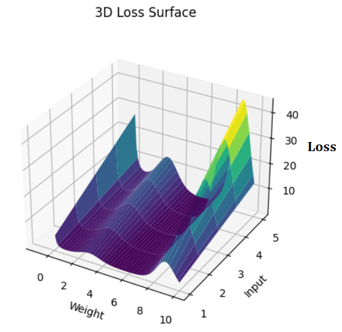

# Deep learning
복습용 정리글

Deep learning은 결국 input에 대해 어떤 function이 작용하여 우리가 원하는 output을 얻어내기 위한 것이다. 기존의 Machine learning에서 나아가 Deep한 신경망을 구축함으로써 보다 복잡하고 잠재성이 높은 신경망을 구현하고자 하였다. 우리가 원하는 신경망이 존재하냐의 문제가 expressivity라 한다면, 그런 신경망을 어떻게 찾을 것이냐가 learning의 문제다. '잘 되는'신경망을 정의하라 한다면 그건 어려운 문제다. 간단하게 생각하면 학습이 빠르게 된다던가, 보다 적은 parameter로 충분한 expressivity를 충족한다던가, overfitting를 더 잘 피한다거나 overflow에 빠지지 않는다던가, local minima에 빠지지 않고 원하는 solution에 잘 수렴해갈 것인가.

input-weight-loss를 그래프화 한것. 실제론 Loss Weight Input 셋 모두 더 많은 축을 갖는다.(Loss는 경우에 따라 한 축만 갖는다.)

신경망은 흔하게 $f(x;\theta)$와 같이 표현된다. Fixed된 신경망의 구조 및 hyperparameter 이외에, 학습으로 $\theta$를 갱신시킬 수 있기 때문이다. $\ input(x)$을 원하는 output에 mapping시키기 위해선, $\theta$를 학습시켜 원하는 함수를 만들어내야 한다.

$\theta$는 일반적으로 곱 연산인 weight와 합 연산 bias를 얘기한다. 그러나 선형연산만으로는 복잡한 비선형함수를 표현해 낼 수 없기 때문에, input에 대해 비선형성을 부여할 수 있는 비선형 활성화함수를 사용한다. 최근엔 일반적으로 Relu를 사용한다. 단순하고, 성능에 대해 신뢰할 수 있기 때문이다.

몇가지 의문이 든다.

1. Relu가 Optimal한 활성화함수인가?
2. Relu 외에 Leaky relu, swish 등 Relu와 비슷하거나 파생된 활성화함수가 성능이 더 좋을 때가 있다. 왜 그런가?
3. 연속함수 활성화함수로는 불연속함수에 대해 균등수렴시킬 수 없다(점별수렴은 가능하다). 그렇다면 이 상황에서 균등수렴과 점별수렴이 어떤 차이가 있는가(애초에 이산 값을 갖는 컴퓨터에서 불연속을 어떻게 정의할 것인가)?

3번이 사실 중요한 문제인지 잘 모르겠다. 더 생각해봐야할것같다.
